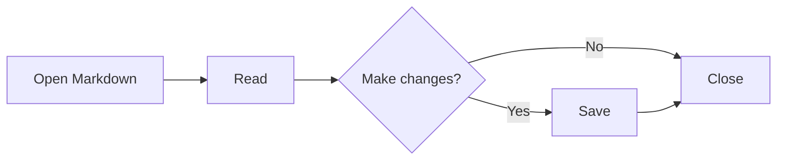
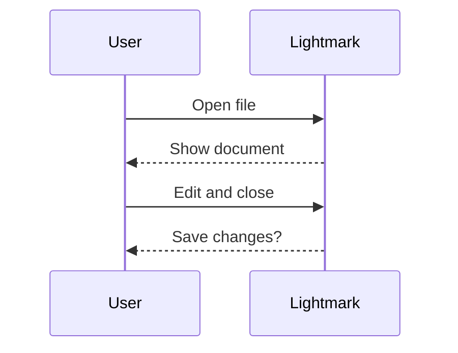

# Advanced Markdown

## Flowchart

## Sequence diagram

## Definition lists

Markdown
: A readable plain-text document format.

Mermaid
: Diagrams described in fenced code blocks.

## Highlights and scientific notation

==Remember this==. Water: H~2~O. Area: x^2^.
