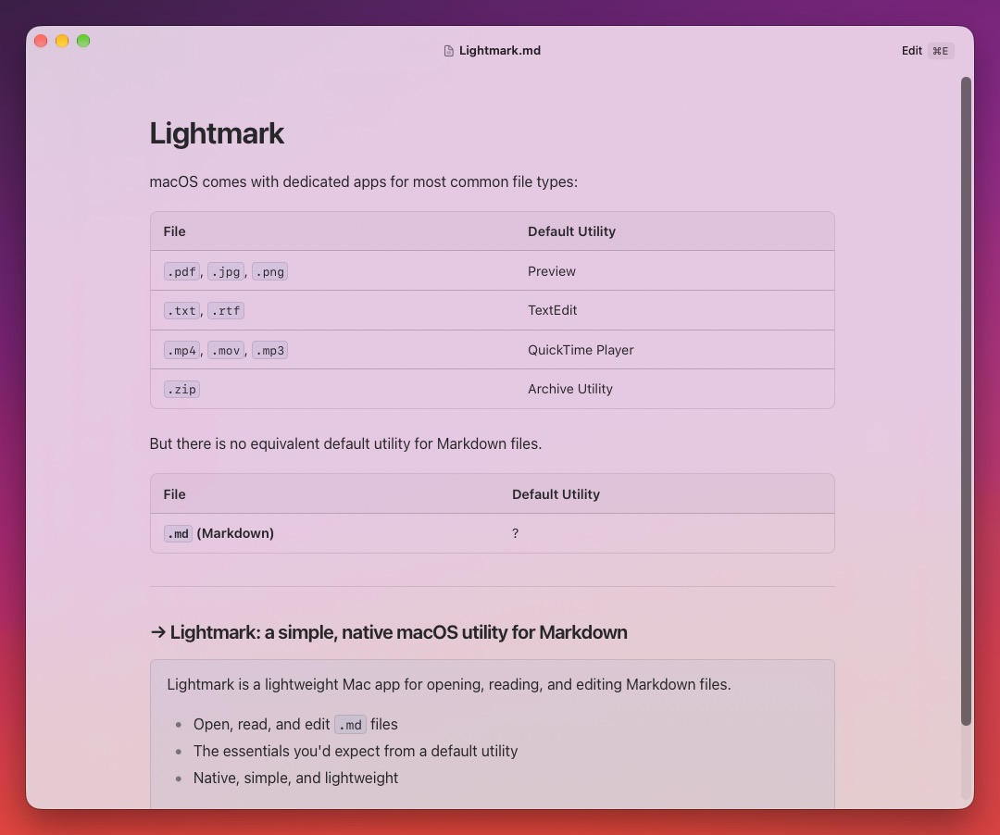
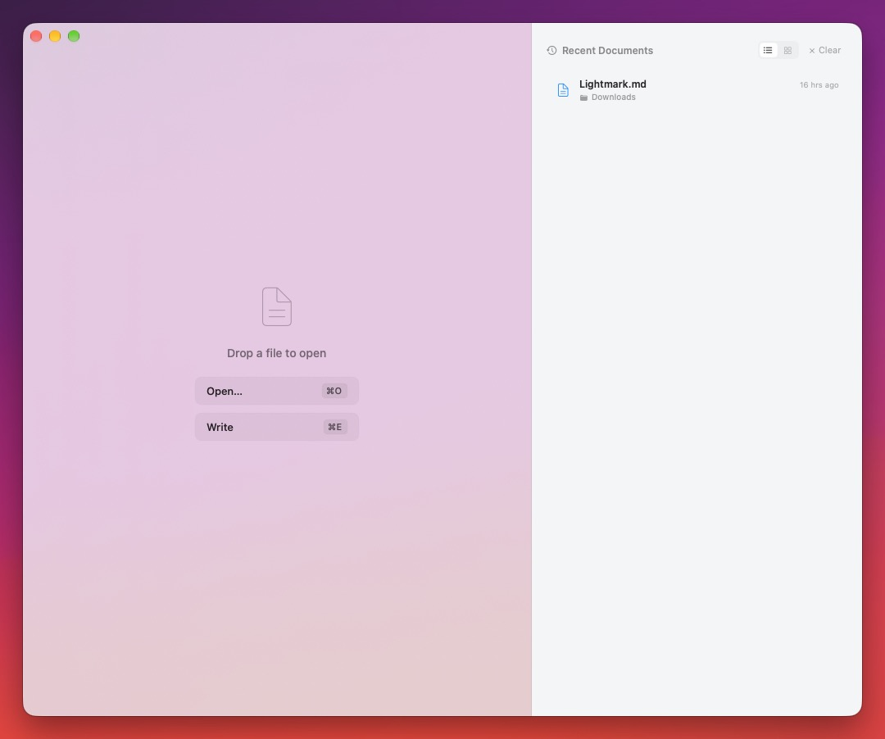
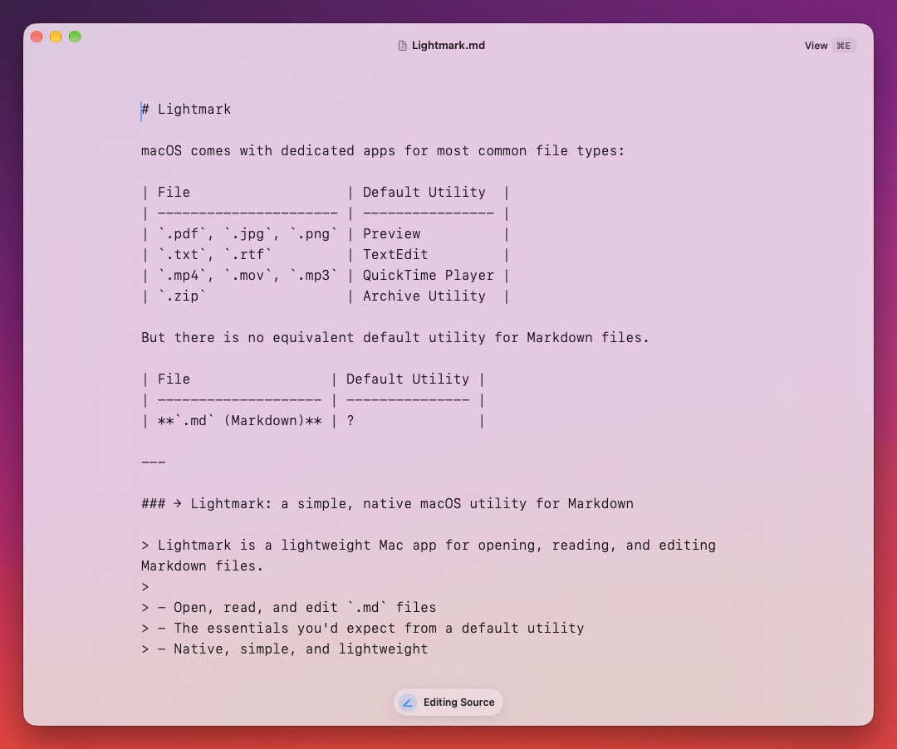

  <picture>
    <source media="(prefers-color-scheme: dark)" srcset="docs/images/lightmark-title-dark.svg">
    
  </picture>

  

  

  

---

  

 macOS comes with **dedicated apps** for most common file types:

| File                   | Default Utility  |
| ---------------------- | ---------------- |
| `.pdf`, `.jpg`, `.png` | Preview          |
| `.txt`, `.rtf`         | TextEdit         |
| `.mp4`, `.mov`, `.mp3` | QuickTime Player |
| `.zip`                 | Archive Utility  |

But there is **no equivalent default utility** for **Markdown files**.

| File                 | Default Utility |
| -------------------- | --------------- |
| **`.md` (Markdown)** | ?               |

### → Lightmark: a simple, native macOS utility for Markdown

> Lightmark is a **lightweight Mac app** for **opening, reading, and editing** Markdown files.
>
> - Open, read, and edit `.md` files
> - The essentials you'd expect from a default utility
> - **Native, simple, and lightweight**

  

  

  

  

